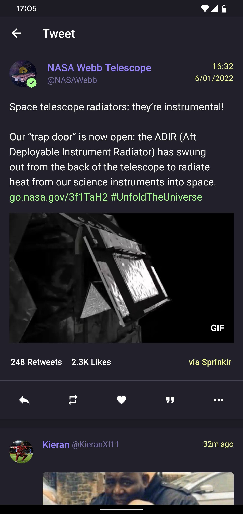

# Dracula Theme 🧛 for Flamingo
Dracula Pro theme for the Android twitter client Flamingo made by [Sam Ruston](https://samruston.com/)

## Installation

1. Open the main menu (hamburger icon top left)
2. Go to **Settings** / **Advanced** / **App Settings** / **Import App Settings**
3. Choose the downloaded `settings.json` file. Colors should be applied immediately.
4. Now... go back to the dark you filth 🧛

## Screenshots

